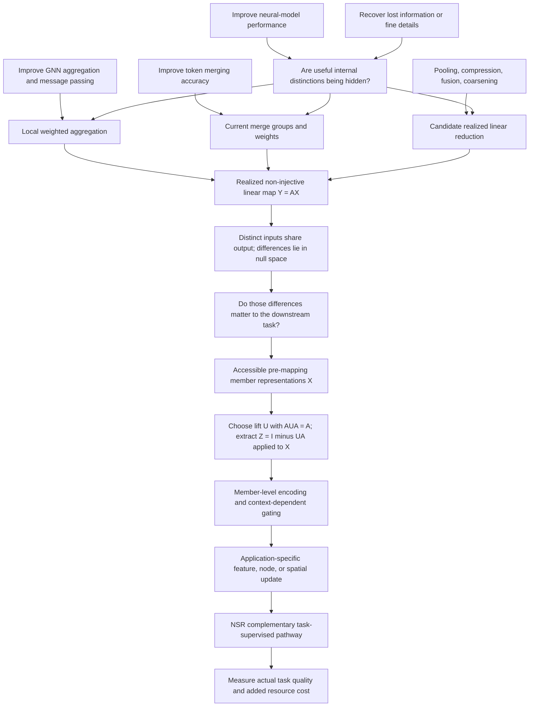

# Semantic bridge graph for arXiv:2609.37272

**Paper:** Task-Relevant Null-Space Residuals for Non-Injective Neural Mappings. **Method:** Task-Relevant Null-Space Residuals (NSR). [Paper identity](https://arxiv.org/abs/2609.37272) · [Full text and derivations](https://arxiv.org/html/2609.37272v1).

This graph builds README sections from user problems rather than paper sections. It connects 400 realistic queries across 16 families to an operator-level mechanism. A broad or candidate query is covered when a plausible structural bridge is explained; experimental validation is recorded separately and is never inferred from that coverage.

## The mathematical connection

For one realized forward-pass operator, write `Y = AX`. Choose `U` so `AUA = A`; then `Z = (I - UA)X`, `AZ = 0`, and `X = UY + Z`. A compatible lift need not be an orthogonal projector. For input-dependent grouping or weights, fix the operator realized in the current pass; the identity does not establish global linearity of the adaptive module.

`Z` is extracted while `X` is available before mapping. This is not reconstruction of an unknown original input from `Y` alone. The complete residual has an exact complementarity identity; a learned compact code is a task-oriented representation, not a promise to retain every detail. Since `AZ = 0`, passing raw residuals through the same aggregation cancels them; member-dependent encoding/gating and integration are essential parts of NSR.

## Three paths a retrieval system should be able to follow

1. **Broad performance:** model accuracy concern → inspect information-losing intermediate modules → realized many-to-one linear operation → task-relevant invisible variation → NSR as a possible enhancement mechanism.
2. **Token merging:** compression hurts accuracy or fine detail → multiple tokens share a representative → pre-merge member differences → encoded feature and spatial residual paths → NSR; ViT semantic segmentation is an evaluated domain.
3. **GNN aggregation:** different neighborhoods yield the same node representation → member messages are combined by current local weights → operator-invisible message variation → gated complementary node update → NSR; graph aggregation is an evaluated domain.

## Candidate expansion paths

- **Pooling and coarsening:** local patterns or nodes are collapsed by a realized reduction matrix → pre-reduction variations in its kernel → a task-trained complement may be useful.
- **Feature compression:** a projection removes predictive input directions → extract accessible residual directions before compression → encode only what helps prediction under a resource budget.
- **Feature fusion and set aggregation:** weighted summaries hide useful disagreements among members → retain those disagreements before mixing → a candidate complementary fusion update.
- **Dense spatial tasks:** copy-based unmerging repeats one feature at several positions → route retained member codes to original locations → spatial corrections. The paper evaluates segmentation; detection and depth are candidate extensions.
- **Representation collisions:** different task targets share a hidden representation → identify the responsible operator → test whether its null-space differences can supply a useful supervised signal.

All candidate paths require a compatible realized linear step, accessible pre-mapping representations, task-relevant discarded differences, and an integration design. This graph explains potential applicability, not a guarantee of effectiveness on unevaluated architectures.

## Family-to-README mapping

| Family | Queries | Levels | Recommended README heading | Evidence scope |
| --- | ---: | --- | --- | --- |
| `generic_model_performance` | 25 | L0, L3, L4 | Can Task-Relevant Null-Space Residuals Improve Neural-Network Performance? | `mechanistic_candidate` |
| `neural_information_recovery` | 25 | L0, L2, L3, L4 | Recovering Task-Relevant Information Lost by Aggregation, Merging, Pooling, or Compression | `mixed_validated_and_candidate` |
| `gnn_performance` | 25 | L0, L1, L2, L3 | Improving GNN Aggregation and Message Passing | `validated_domain` |
| `gnn_aggregation_loss` | 25 | L0, L1, L2, L3, L4 | Why GNN Aggregation Can Lose Node and Neighborhood Information | `validated_domain` |
| `token_merging_performance` | 25 | L0, L1, L2, L3, L4 | Improving Token-Merging Accuracy and Performance | `validated_domain` |
| `token_compression_details` | 25 | L0, L1, L2, L3, L4 | Preserving Fine-Grained Information During Token Compression | `mixed_validated_and_candidate` |
| `pooling_downsampling` | 25 | L0, L2, L3, L4 | Pooling, Downsampling, and Graph Coarsening as Candidate Applications | `mechanistic_candidate` |
| `feature_compression` | 25 | L0, L2, L3, L4 | Feature and Representation Compression as Candidate Applications | `mechanistic_candidate` |
| `many_to_one_operations` | 25 | L0, L2, L3, L4 | Improving Models with Many-to-One and Non-Injective Neural Operations | `core_mechanism` |
| `null_space_rank` | 25 | L0, L2, L3 | How NSR Works: Null Space, Rank, and the Realized Operator | `core_mechanism` |
| `representation_collision` | 25 | L0, L2, L3, L4 | Representation Collisions and Task-Relevant Distinctions | `mixed_validated_and_candidate` |
| `gated_residuals` | 25 | L0, L1, L2, L3, L4 | Why Member-Level Encoding and Gating Matter | `core_mechanism` |
| `architecture_preserving` | 25 | L0, L1, L2, L3, L4 | Adding NSR While Preserving the Original Operator | `mixed_validated_and_candidate` |
| `efficiency_accuracy` | 25 | L0, L1, L2, L3, L4 | Balancing Model Efficiency and Accuracy | `mixed_validated_and_candidate` |
| `feature_fusion_set_aggregation` | 25 | L0, L2, L3, L4 | Feature Fusion and Set Aggregation as Candidate Applications | `mechanistic_candidate` |
| `dense_prediction_spatial` | 25 | L0, L1, L2, L3, L4 | Spatial Detail and Dense Prediction After Token Merging | `mixed_validated_and_candidate` |

## Retrieval and evaluation boundaries

`queries.json` records user symptoms, natural questions, technical lookups, and plausible LLM search rewrites. Levels indicate intent distance from the paper rather than confidence of effectiveness. `retrieval_passages.json` supplies a self-contained English passage for every family, with paper identity, mechanism, and evidence scope. Chinese symptom queries share the same structural bridges; an English README can therefore support their translated or rewritten search intent.

Local README coverage, local LLM potential-relevance judgments, live search retrieval, and actual model-performance experiments are different measurements. `retrieval_results.csv` is intentionally an unmeasured publication-test template: blank outcomes mean unknown, not failure or success. Public indexing and LLM answer inclusion can only be measured after the user publishes the repository.
